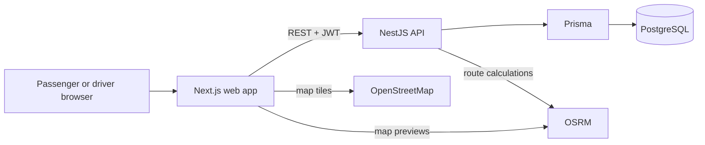
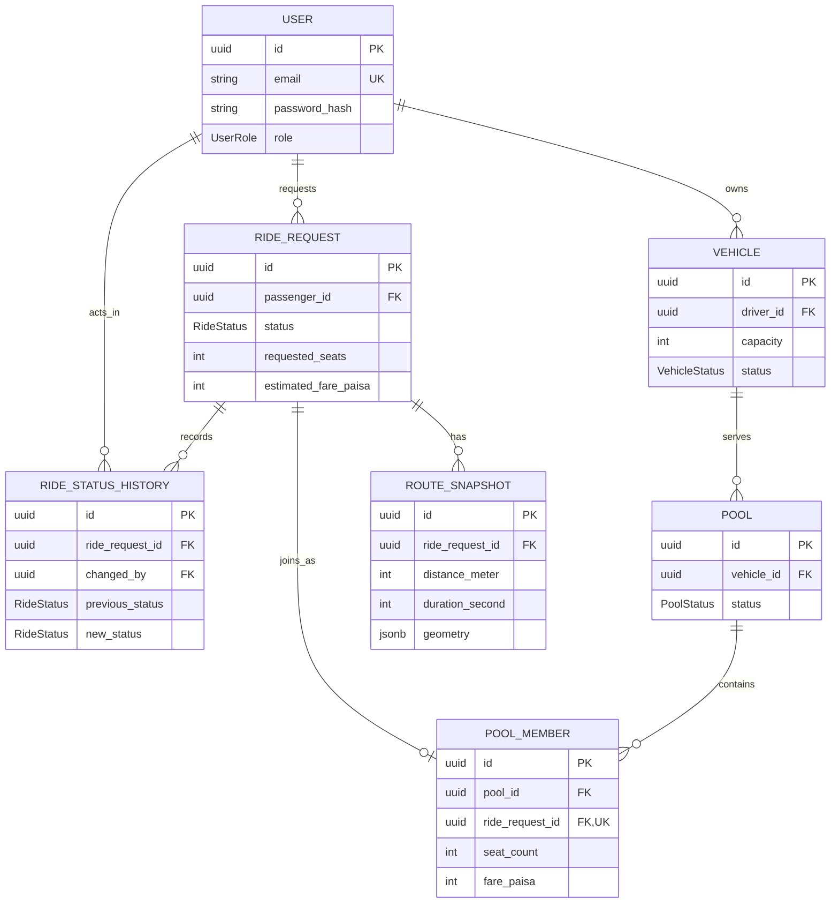

# Dhaka Tesla Pool

Share a seat. Split the fare. Survive Dhaka traffic.

Dhaka Tesla Pool is a ride-pooling MVP for passengers and drivers in Dhaka. Passengers request rides and see their own status and fare; drivers manage a vehicle, accept nearby requests, and move assigned rides through the trip lifecycle. The backend owns routing-based pricing, ride and pool state, and seat capacity.

**Live deployment:** [Web app](https://dhaka-tesla-pool-lemon-chi.vercel.app) (Vercel) | [API](https://dhaka-tesla-pool-qaln.onrender.com) (Render). The deployed PostgreSQL database is hosted on Neon. These deployment details were supplied by the project maintainer.

## The Scenario

Jashim drives Bullet, a three-seat vehicle. Nusrat and Rafiq request trips from Banani toward nearby destinations; Shirin may request the last seat. The system needs to keep each passenger's fare and history separate, reject invalid trip changes, and prevent two requests from claiming the same remaining seat.

The repository includes Jashim, Bullet, Nusrat, Rafiq, and Shirin as deterministic development seed data. It does not seed rides or pools.

## What Is Implemented

| Area | Current behavior |
| --- | --- |
| Accounts | Passenger and driver registration and login; bcrypt password hashes; JWT bearer authentication and role checks. |
| Passenger | Request a ride from coordinates or the map, see ride history and details, see an estimated or pooled fare, and cancel while the lifecycle permits. |
| Driver | Go online or offline, see nearby requests, accept a request or auto-assign the closest one, view assigned and recently completed rides, and mark arrival, start, and completion. |
| Pooling | Create a pool for eligible rides, compare initial ride sets using pickup/destination proximity and routed detour, allocate seats transactionally, and manage pool status. |
| Routing and maps | OSRM supplies backend route distance, duration, and geometry. The browser uses Leaflet/OpenStreetMap and requests an OSRM route for map previews. |
| Persistence | PostgreSQL and Prisma store users, vehicles, rides, route snapshots, pools, memberships, and ride status history. |

There is no public pool management endpoint. Driver acceptance is the current application entry point for creating or joining a pool.

## Architecture



The NestJS API is a modular monolith. `auth` and `users` own identity and persistence access; `ride` owns passenger requests and ride transitions; `routing` wraps OSRM behind a provider-neutral service; `fare` calculates prices; `pool` owns matching, membership, capacity, and pool transitions; `driver` handles driver-owned vehicles and assigned rides. The web app groups its API wrappers, hooks, and components by feature. Business decisions and authorization are enforced by the API, although the browser also shows a local fare preview.

## Data Model



Prisma maps TypeScript fields to snake_case PostgreSQL columns. Primary keys are UUIDs; route geometry is JSONB; money is stored as integer paisa (100 paisa = BDT 1). A driver may own multiple vehicles, and a ride may have multiple route snapshots. `pool_members.ride_request_id` is unique, so a ride can have at most one membership. The migration adds checks for positive capacities and seat counts and non-negative fares, distances, and durations. See [database design](docs/database.md) and [Prisma schema](apps/api/prisma/schema.prisma).

## Core Rules

### Ride lifecycle

```text
REQUESTED -> MATCHED -> DRIVER_ARRIVED -> STARTED -> COMPLETED
      |          |                  |
      +----------+------------------+-> CANCELLED
```

Cancellation is permitted by the backend from `REQUESTED`, `MATCHED`, or `DRIVER_ARRIVED`. `COMPLETED` and `CANCELLED` are terminal. Every accepted transition updates the ride and appends a `RideStatusHistory` record in one transaction. Passenger ride queries filter by the authenticated passenger ID; driver actions check vehicle ownership and require the assigned vehicle to be `ONLINE`.

### Fare

The API's current pricing configuration is **BDT 20 base fare**, **BDT 5 per started kilometer**, and **20% off for a pooled ride**. Distance is rounded up with `ceil(distanceMeter / 1000)`. The discount is rounded down to whole paisa.

```text
subtotalPaisa = 2000 + ceil(distanceMeter / 1000) * 500
discountPaisa = isPooled ? floor(subtotalPaisa * 20 / 100) : 0
finalFarePaisa = subtotalPaisa - discountPaisa
```

For 5,230 meters, billing distance is 6 km: 2,000 + 3,000 = 5,000 paisa (BDT 50); the pooled fare is 4,000 paisa (BDT 40). Each pool member stores an individual fare. The ride form mirrors these rates for its pre-submission preview, while the API remains authoritative and calculates the persisted fare from its own route result.

### Pool matching and capacity

Initial multi-ride pool creation checks that every ride is `REQUESTED`, that total requested seats fit the vehicle, and that each pair of rides passes all three rules:

| Check | Maximum |
| --- | ---: |
| Pickup separation (Haversine) | 2,000 m |
| Destination separation (Haversine) | 3,000 m |
| Shared-route detour relative to each solo route | 30% |

For each pair, `RoutingService` asks OSRM for the route through pickup A, pickup B, destination A, and destination B. The matcher uses the larger of the two passengers' detour percentages. It does not use predefined Dhaka zones or optimize waypoint order. `PoolCreationService` locks the vehicle row, checks for an existing `MATCHING` or `ACTIVE` pool, and writes the pool, members, fares, and ride transitions in one transaction.

Joining an existing pool uses `SELECT ... FOR UPDATE` on the pool row, then recalculates occupied seats before inserting a membership. The rule is `currentSeats + requestedSeats <= vehicle.capacity`; Bullet's seeded capacity is three. Pool states are `MATCHING -> ACTIVE -> COMPLETED`, with cancellation allowed from `MATCHING` or `ACTIVE`. Starting a ride activates its pool; completing the last assigned ride completes the pool. Completed and cancelled pools do not block a future pool for the same vehicle.

## Technology Choices

| Choice | Why it fits this MVP | Alternative or switch point |
| --- | --- | --- |
| Next.js App Router + TypeScript + Tailwind CSS | Feature routes, typed UI, and a small deployment surface. | A React/Vite SPA would be simpler if server rendering and App Router routing were unnecessary. |
| NestJS + TypeScript | Modules and dependency injection keep ride, pool, fare, and routing responsibilities separate. | Express or Fastify could reduce framework overhead for a smaller API. |
| PostgreSQL + Prisma | Foreign keys, transactions, row locks, migrations, and typed queries support the seat invariant. | Direct SQL or a lighter query builder may suit more specialized queries; SQLite lacks the same concurrent row-locking behavior. |
| JWT + bcrypt | Stateless API authentication and password hashing for passenger/driver roles. | Server sessions could improve token revocation and browser storage security. |
| OSRM + OpenStreetMap + Leaflet | Road routes and map display without a paid map API. | A managed routing provider may be needed for stronger availability, support, or traffic-aware routing. |
| Vitest + Testing Library | Fast unit, service, and component checks across both TypeScript workspaces. | Add database-backed integration tests for deployment-critical transaction behavior. |

## Repository Layout

```text
apps/
  api/          NestJS modules, Prisma schema, migration, and seed
  web/          Next.js App Router and feature-based UI
packages/
  shared/       Workspace reserved for shared package code
agent-context/  Product requirements and architecture decisions
docs/           Database notes and design records
.github/        CI workflow
docker-compose.yml
```

## Local Development

Use Node.js 22 and npm (the root package declares a minimum of Node.js 20.19). Docker Compose is needed for the local PostgreSQL container.

1. From the repository root, copy `.env.example` to `.env` and `apps/web/.env.example` to `apps/web/.env.local`. Set a local `JWT_SECRET`, a reachable `OSRM_BASE_URL`, and `NEXT_PUBLIC_API_URL=http://localhost:3000` in the web file. Keep `.env` files out of Git.
2. Install dependencies and start PostgreSQL:

   ```sh
   npm ci
   docker compose up -d db
   ```

3. Generate Prisma Client, apply the committed migration, and load the development cast:

   ```sh
   npm run db:generate --workspace=@dhaka-tesla-pool/api
   npm run db:migrate:deploy --workspace=@dhaka-tesla-pool/api
   npm run db:seed --workspace=@dhaka-tesla-pool/api
   ```

4. Start the API and web app in separate terminals:

   ```sh
   npm run dev:api
   npm run dev:web
   ```

Open `http://localhost:3001`; the API listens on `http://localhost:3000`. The root `DATABASE_URL` should use `localhost` for local workspace commands. Prisma CLI configuration and seed load the root `.env` file.

| Variable | Use |
| --- | --- |
| `POSTGRES_USER`, `POSTGRES_PASSWORD`, `POSTGRES_DB`, `POSTGRES_PORT` | Local Compose database credentials and port. |
| `DATABASE_URL` | API and Prisma connection string; set this to the Neon connection string on Render. |
| `JWT_SECRET`, `JWT_EXPIRES_IN` | Token signing secret and lifetime (`1h` when omitted by the API). Use a private secret in deployment. |
| `OSRM_BASE_URL` | Server-side OSRM base URL. Ride creation needs a reachable routing provider. |
| `NEXT_PUBLIC_API_URL` | Browser-facing API URL; set at web build time (including on Vercel). |
| `NEXT_PUBLIC_OSRM_URL` | Optional browser map-preview OSRM URL; the current code otherwise uses the public OSRM demo endpoint. |
| `API_PORT`, `WEB_PORT` | Published Compose ports; defaults are `3000` and `3001`. |

The seed creates development accounts with fixed hashes but does not publish a known login password. For an interactive walkthrough, register fresh passenger and driver accounts with different emails; the driver vehicle endpoint creates an offline, three-seat Bullet for a driver with no vehicle.

## Docker Compose

Compose builds the API and web images and starts them with PostgreSQL. It does **not** apply migrations or seed automatically. With a configured root `.env`, use:

```sh
docker compose up -d db
docker compose build api web
docker compose run --rm api npm run db:migrate:deploy
docker compose run --rm api npm run db:seed
docker compose up -d
```

The Compose API uses `db` as the database hostname; the web app still calls the API through the browser-facing `NEXT_PUBLIC_API_URL`. OSRM is an external service, not a Compose container. Do not reuse the example JWT or database credentials on a public host. For existing databases, run the migration command without reseeding unless demo data is intended.

## API Overview

All routes below are provided by the NestJS API. Except for registration and login, they require a JWT; ride routes require `PASSENGER`, and driver routes require `DRIVER`.

| Method | Path | Purpose |
| --- | --- | --- |
| `POST` | `/auth/register` | Register a passenger or driver. |
| `POST` | `/auth/login` | Receive an access token and public user. |
| `GET` | `/auth/me` | Read the authenticated user. |
| `POST` | `/rides` | Create a ride with pickup and destination coordinates. |
| `GET` | `/rides` | List the passenger's own rides. |
| `GET` | `/rides/:id` | Get one owned ride, including pool summary when assigned. |
| `PATCH` | `/rides/:id/cancel` | Cancel an owned ride when its state permits. |
| `GET` | `/driver/vehicles` | Get driver vehicles; creates a default Bullet if none exists. |
| `PATCH` | `/driver/vehicles/:id/status` | Set an owned vehicle `ONLINE` or `OFFLINE`. |
| `GET` | `/driver/pools` | List pools for the driver's vehicles. |
| `GET` | `/driver/rides/assigned` | List active assigned rides. |
| `GET` | `/driver/rides/completed` | List up to 10 recently completed rides. |
| `GET` | `/driver/rides/nearby?lat=&lng=&radius=` | Find `REQUESTED` rides near the supplied location; default radius 3 km. |
| `POST` | `/driver/rides/:id/accept` | Accept a request for the driver's online vehicle. |
| `POST` | `/driver/rides/auto-assign` | Accept the closest request to supplied coordinates. |
| `PATCH` | `/driver/rides/:id/arrive` | Move an assigned ride to `DRIVER_ARRIVED`. |
| `PATCH` | `/driver/rides/:id/start` | Move an assigned ride to `STARTED`. |
| `PATCH` | `/driver/rides/:id/complete` | Move an assigned ride to `COMPLETED`. |

The API has no public pool endpoint or route-preview endpoint. The frontend's map preview calls OSRM directly, while `POST /rides` obtains its own backend route and fare.

## Testing and CI

```sh
npm run lint:api
npm run lint:web
npm test --workspace=@dhaka-tesla-pool/api
npm test --workspace=@dhaka-tesla-pool/web
npm run test:e2e --workspace=@dhaka-tesla-pool/api
npm run build:api
npm run build:web
docker compose --env-file .env.example config
```

Tests cover authorization, ride and pool transitions, fare rounding, routing response mapping, pool capacity and concurrent seat claims, and passenger/driver UI states. The authentication e2e test uses a mocked Prisma provider. [GitHub Actions](.github/workflows/ci.yml) runs Prisma validation and generation, both workspaces' lint/tests/builds, and Compose configuration validation on pull requests and configured branches. CI does not run a real PostgreSQL/OSRM integration suite or the separate API e2e command.

## Deployment and Demo

- Frontend: [Vercel deployment](https://dhaka-tesla-pool-lemon-chi.vercel.app)
- Backend: [Render deployment](https://dhaka-tesla-pool-qaln.onrender.com)
- Database: Neon PostgreSQL (connection URL is a private environment variable)

Set the deployed API URL as `NEXT_PUBLIC_API_URL` during the Vercel build. On Render, provide `DATABASE_URL`, `JWT_SECRET`, `JWT_EXPIRES_IN`, and `OSRM_BASE_URL`, and apply Prisma migrations with `db:migrate:deploy` before serving traffic. Keep seed data out of a public database unless it is deliberately a demo environment.

For a walkthrough, register a driver and two passengers, bring the driver's vehicle online, request nearby rides, accept them, then mark arrival, start, and completion. The passenger view shows individual ride status and pooled fare; the driver view shows assigned and completed rides. No screenshots or demo video are currently included in this repository.

## Known Limitations

- When a driver accepts a ride into an **existing pool**, the current join path checks capacity but does not rerun corridor compatibility and stores the ride's estimated solo fare as the membership fare. Initial multi-ride pool creation does run compatibility checks and pooled fare calculation. This difference needs to be resolved for consistent pooling behavior.
- The browser stores the access token in `localStorage`; there are no refresh tokens or server-side sessions.
- Driver location is a selected Dhaka hub rather than live GPS. Nearby ride discovery filters an in-memory set of requested rides by Haversine distance, which is appropriate only for small data volumes.
- No payment gateway, live tracking, turn-by-turn navigation, notifications, or automatic waypoint-order optimization is implemented.

At larger scale, nearby search would need indexed geospatial queries; routing and matching could move to workers, and DB contention, observability, token handling, and OSRM capacity would need dedicated work. The MVP keeps seat claims in PostgreSQL transactions rather than adding distributed locking infrastructure.

## AI Use

The [`agent-context/`](agent-context/) folder is the source of truth for AI-assisted work on this project. It contains the original PRD, architecture decisions, domain model, API contract, and rules for fares, ride states, pooling, concurrency, authorization, and testing. Contributions are reviewed against that context and the implemented code before they are accepted.
